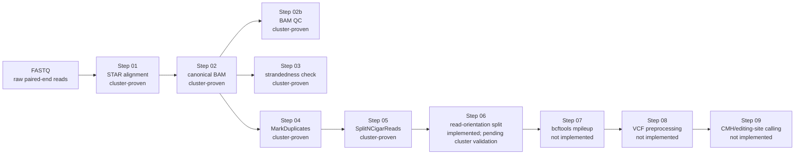
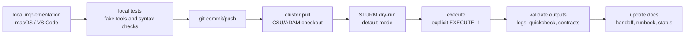

# NORAD Pipeline Architecture

This page is a compact visual map for PI demo use. It summarizes the pipeline shape, validated boundaries, output contracts, and reliability pattern without replacing `docs/PIPELINE_PLAN.md` or `docs/RUNBOOK.md` as the detailed sources of truth.

## One-Screen Summary

This project rebuilds a legacy hardcoded RNA-editing/RNA-seq workflow into a staged, dry-run-first, testable SLURM pipeline.

Steps `00a`-`05` are cluster-proven across the cohort, with Steps `01`-`05` validated across all six samples. Step `06` read-orientation splitting is implemented and locally tested, but pending cluster validation. Steps `07`-`09` are scaffolded / not implemented / not cluster-proven.

Current boundary:

```text
cluster-proven preprocessing through Step 05
-> Step 06 cluster validation
-> Steps 07-09 editing-site calling path
```

## Pipeline Dataflow



Standalone Mermaid source: `docs/architecture_pipeline.mmd`.

## Step Status Matrix

| Step | Main output | Status | Notes |
| ---- | ----------- | ------ | ----- |
| `00a` | `refs/novogene_star_index/` | cluster-proven reference prep | STAR index built with `sjdbOverhang=149`. |
| `00b` | `refs/novogene_ref/genome.bed` | cluster-proven reference prep | BED12 generated for RSeQC. |
| `00c` | `refs/novogene_ref/genome.fa.fai`, `refs/novogene_ref/genome.dict` | cluster-proven reference prep | GATK sidecars validated once, not inside per-sample jobs. |
| `01` | `results/star/<sample>/` | cluster-proven across all six samples | STAR alignment. |
| `02` | `results/bam/<sample>/<sample>.sorted.bam(.bai)` | cluster-proven across all six samples | Canonical coordinate-sorted, read-group-tagged BAM. |
| `02b` | `results/qc/bam/<sample>.*.txt` | cluster-proven across all six samples | BAM quickcheck/flagstat QC. |
| `03` | `results/qc/strandedness/<sample>.infer_experiment.txt` | cluster-proven across all six samples | All six libraries are reverse-stranded / first-strand-style. |
| `04` | `results/markdup/<sample>/<sample>.markdup.bam(.bai)` | cluster-proven across all six samples | Duplicate reads are marked, not removed. |
| `05` | `results/split_ncigar/<sample>/<sample>.split_ncigar.bam(.bai)` | cluster-proven across all six samples | GATK temp handling hardened to project storage. |
| `06` | `results/orientation/<sample>/`, `results/qc/orientation/` | implemented and locally tested; pending cluster validation | Mechanical `FWD_like` / `REV_like` split. |
| `07` | per-chromosome/per-orientation VCF files | scaffolded / not implemented / not cluster-proven | bcftools path is known; workflow behavior still pending. |
| `08` | cleaned/annotated VCF-like tables | scaffolded / not implemented / not cluster-proven | R/Rscript availability still unresolved. |
| `09` | CMH/editing-site result tables and plots | scaffolded / not implemented / not cluster-proven | Final deliverable format still needs PI-guided definition. |

## Data Contracts

| Stage | Contract |
| ----- | -------- |
| STAR alignment | `results/star/<sample>/` |
| Canonical BAM | `results/bam/<sample>/<sample>.sorted.bam(.bai)` |
| MarkDuplicates | `results/markdup/<sample>/<sample>.markdup.bam(.bai)` |
| SplitNCigarReads | `results/split_ncigar/<sample>/<sample>.split_ncigar.bam(.bai)` |
| Read-orientation BAMs | `results/orientation/<sample>/<sample>.FWD_like.bam(.bai)` and `results/orientation/<sample>/<sample>.REV_like.bam(.bai)` |
| Orientation QC | `results/qc/orientation/<sample>.orientation_counts.tsv` |

## Reliability Workflow



Standalone Mermaid source: `docs/architecture_reliability.mmd`.

Safeguards:

- dry-run default
- explicit `EXECUTE=1`
- per-sample locks
- run-token temp files
- validate-before-publish
- rollback protection
- cleanup on failure
- fake-tool shell tests
- troubleshooting docs

## Local Vs Cluster Responsibilities

| Local macOS | CSU/ADAM SLURM |
| ----------- | -------------- |
| Edit scripts/docs/tests. | Run real STAR/samtools/Picard/GATK/bcftools jobs. |
| Run fake-tool shell tests and syntax checks. | Execute sample-scale workflows through `jobs/*.slurm`. |
| Validate command construction and dry-run behavior. | Inspect SLURM logs, scheduler status, and output files. |
| Commit/push reviewed changes. | Pull committed changes before dry-run and execute gates. |

## Biological Interpretation Caution

`FWD_like` and `REV_like` are mechanical read-orientation groups based on legacy samtools flag filters. They are not automatically biological strand, transcript strand, sense, or antisense labels.

```text
FWD_like = samtools view -f 99 plus samtools view -f 147
REV_like = samtools view -f 83 plus samtools view -f 163
```

`samtools view -f FLAG` means a record has all bits in `FLAG`; it is not exact flag equality.

## What Remains

1. Finish Step `06` cluster validation.
2. Implement Step `07` bcftools mpileup.
3. Port Step `08` VCF preprocessing.
4. Port Step `09` CMH/editing-site calling.
5. Review QC and biological interpretation with PI guidance.
