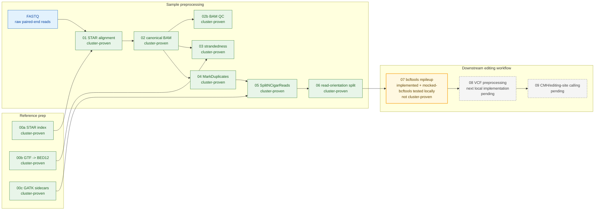
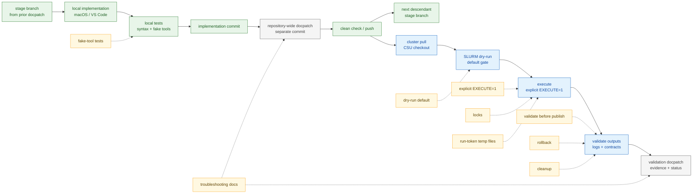

# NORAD Pipeline Architecture

This page is a compact visual map for PI demo use. It summarizes the pipeline shape, validated boundaries, output contracts, and reliability pattern without replacing `docs/design/PIPELINE_PLAN.md` or `docs/operations/RUNBOOK.md` as the detailed sources of truth.

For deferred modular architecture ideas, see `docs/architecture/FUTURE_ARCHITECTURE.md`.

## One-Screen Summary

This project rebuilds a legacy hardcoded RNA-editing/RNA-seq workflow into a staged, dry-run-first, testable SLURM pipeline.

Steps `00a`-`00c` are cluster-proven reference prep. Steps `01`-`06` are cluster-proven across all six samples. Step `07` is implemented locally and locally tested with mocked bcftools at commit `e68b00c`; it has not run with real bcftools, passed a cluster dry-run, executed on the cluster, or produced inspected cluster outputs, and it is not cluster-proven. Steps `08`-`09` remain pending / not implemented / not cluster-proven, and Step `08` is the next local implementation boundary.

Current boundary:

```text
cluster-proven reference prep through Steps 00a-00c
-> cluster-proven sample workflow through Step 06
-> Step 07 implemented and locally tested with mocked bcftools; cluster validation pending
-> Step 08 next local implementation boundary
-> Step 09 pending editing-site calling
```

## Pipeline Dataflow



Standalone Mermaid source: `docs/architecture/diagrams/pipeline.mmd`.

## Step Status Matrix

| Step | Main output | Status | Notes |
| ---- | ----------- | ------ | ----- |
| `00a` | `refs/novogene_star_index/` | cluster-proven reference prep | STAR index built with `sjdbOverhang=149`. |
| `00b` | `refs/novogene_ref/genome.bed` | cluster-proven reference prep | BED12 generated for RSeQC. |
| `00c` | `refs/novogene_ref/genome.fa.fai`, `refs/novogene_ref/genome.dict` | cluster-proven reference prep | GATK sidecars validated once, not inside per-sample jobs. |
| `01` | `results/star/<sample>/` | cluster-proven across all six samples | STAR alignment. |
| `02` | `results/bam/<sample>/<sample>.sorted.bam(.bai)` | cluster-proven across all six samples | Canonical coordinate-sorted, read-group-tagged BAM. |
| `02b` | `results/qc/bam/<sample>.*.txt` | cluster-proven across all six samples | BAM quickcheck/flagstat QC. |
| `03` | `results/qc/strandedness/<sample>.infer_experiment.txt` | cluster-proven across all six samples | All six libraries are reverse-stranded / first-strand-style. |
| `04` | `results/markdup/<sample>/<sample>.markdup.bam(.bai)` | cluster-proven across all six samples | Duplicate reads are marked, not removed. |
| `05` | `results/split_ncigar/<sample>/<sample>.split_ncigar.bam(.bai)` | cluster-proven across all six samples | GATK temp handling hardened to project storage. |
| `06` | `results/orientation/<sample>/`, `results/qc/orientation/` | cluster-proven across all six samples | Mechanical `FWD_like` / `REV_like` split. |
| `07` | `results/mpileup/<cohort>/<partition>/<cohort>.<partition>.FWD_like.mpileup.vcf`, `results/mpileup/<cohort>/<partition>/<cohort>.<partition>.REV_like.mpileup.vcf`, and `results/mpileup/<cohort>/<partition>/<cohort>.<partition>.step07_outputs.tsv` | implemented locally and locally tested with mocked bcftools; not cluster-proven | Cohort-wide per declared partition. No real-bcftools runtime, cluster dry-run, execute run, or inspected cluster output yet. |
| `08` | `results/vcf_preprocessed/<cohort>/<cohort>.step08_sites.tsv`, `results/vcf_preprocessed/<cohort>/<cohort>.step08_inputs.tsv`, and `results/qc/vcf_preprocessing/<cohort>.step08_summary.tsv` | pending / not implemented / not cluster-proven | Approved contract exists; R/Rscript availability and real-R fixture validation remain unresolved. |
| `09` | six approved tables/plots under `results/editing/<analysis>/` | pending / not implemented / not cluster-proven | Approved paired-CMH output contract exists; implementation and real-R validation remain pending. |

## Data Contracts

| Stage | Contract |
| ----- | -------- |
| STAR alignment | `results/star/<sample>/` |
| Canonical BAM | `results/bam/<sample>/<sample>.sorted.bam(.bai)` |
| MarkDuplicates | `results/markdup/<sample>/<sample>.markdup.bam(.bai)` |
| SplitNCigarReads | `results/split_ncigar/<sample>/<sample>.split_ncigar.bam(.bai)` |
| Read-orientation BAMs | `results/orientation/<sample>/<sample>.FWD_like.bam(.bai)` and `results/orientation/<sample>/<sample>.REV_like.bam(.bai)` |
| Orientation QC | `results/qc/orientation/<sample>.orientation_counts.tsv` |
| Cohort mpileup partition | `results/mpileup/<cohort>/<partition>/<cohort>.<partition>.FWD_like.mpileup.vcf`, `results/mpileup/<cohort>/<partition>/<cohort>.<partition>.REV_like.mpileup.vcf`, and `results/mpileup/<cohort>/<partition>/<cohort>.<partition>.step07_outputs.tsv` |

## Reliability Workflow



Standalone Mermaid source: `docs/architecture/diagrams/reliability.mmd`.

Safeguards:

- dry-run default
- explicit `EXECUTE=1`
- scope-owned locks, including sample and cohort/partition locks
- run-token temp files
- validate-before-publish
- rollback protection
- cleanup on failure
- fake-tool shell tests
- troubleshooting docs

## Local Vs Cluster Responsibilities

| Local macOS | CSU/ADAM SLURM |
| ----------- | -------------- |
| Edit scripts/docs/tests. | Run real STAR/samtools/Picard/GATK/bcftools jobs. |
| Run fake-tool shell tests and syntax checks. | Execute sample-scale workflows through `jobs/*.slurm`. |
| Validate command construction and dry-run behavior. | Inspect SLURM logs, scheduler status, and output files. |
| Commit/push reviewed changes. | Pull committed changes before dry-run and execute gates. |

## Biological Interpretation Caution

`FWD_like` and `REV_like` are mechanical read-orientation groups based on legacy samtools flag filters. They are not automatically biological strand, transcript strand, sense, or antisense labels.

```text
FWD_like = samtools view -f 99 plus samtools view -f 147
REV_like = samtools view -f 83 plus samtools view -f 163
```

`samtools view -f FLAG` means a record has all bits in `FLAG`; it is not exact flag equality.

## What Remains

1. Create the descendant Step `08` branch from the clean, pushed Step `07` implementation and docpatch history.
2. Implement, locally test, and docpatch Step `08`, then repeat the gate for Step `09`.
3. Begin later cluster promotion with a Step `07` dry-run and narrow pilot before primary-contig execution.
4. Do not execute downstream stages on the cluster until each preceding stage is cluster-proven.
5. Review QC and biological interpretation with PI guidance.
