# NORAD Pipeline Architecture

This page is a compact visual map for PI demo use. It summarizes the pipeline shape, validated boundaries, output contracts, and reliability pattern without replacing `docs/design/PIPELINE_PLAN.md` or `docs/operations/RUNBOOK.md` as the detailed sources of truth.

For deferred modular architecture ideas, see `docs/architecture/FUTURE_ARCHITECTURE.md`.

## One-Screen Summary

This project rebuilds a legacy hardcoded RNA-editing/RNA-seq workflow into a staged, dry-run-first, testable SLURM pipeline.

Steps `00a`-`00c` are cluster-proven reference prep. Steps `01`-`06` are
cluster-proven across all six samples. Step `07` is implemented locally and
mocked-bcftools tested at commit `e68b00c`, but it has no real-bcftools or
cluster evidence. Step `08` is implemented locally at `90335d8`, and Step
`09` is implemented locally at `e4371de`; both retain passing shell/fake-R
contracts.

The signed and notarized Apple-silicon CRAN R `4.6.1` runtime is now installed
locally. A guarded repository `renv` environment is locked to Bioconductor
`3.23` and activates only with `NORAD_USE_RENV=1`. Namespace, lock consistency,
headless PDF, and empty cache-disabled binary restore checks pass. Both real-R
fixture suites now pass locally without `SKIP`. The Step `09b1` implementation
at `eae5eca` adds Step `08` raw DP/AD/INFO AD lexical validation before
semantic parsing and makes the Step `09` PDF EOF fixture locale-independent
with raw-byte matching. The Step `08` partition-overlap validator was already
correct; a generic negative-fixture message had misattributed the later
malformed-count failure.

No Step `07`-`09` remote dry-run, execute, log, or output evidence was added;
all three remain not cluster-proven. Step `09c` is implemented at `b674a31`
and synthetic-fixture-tested locally, but no production evidence package or
scientific review exists. The `artifact-schema-v1` foundation is implemented
and locally fixture-tested at `5f4d3b4`; it defines contracts and an explicit
expected-artifact inventory. `artifact-adapters-v1` is implemented and locally
fixture-tested at `4dbd32d`; the indexer uses 49 read-only adapter
specifications to inspect/reconcile sources and centrally publishes explicit
records/index/receipt fixture transactions. `artifact-run-summary` is
implemented and locally fixture-tested at `209bb19`; it publishes canonical
JSON, deterministic artifact/QC TSV views, and a receipt last.
`report-html-v1` is implemented at `117ba26`: it consumes that one canonical
JSON input and uses a static, non-executing QMD view plus pinned Quarto `1.9.38`
to publish one self-contained, script-free HTML file. The official macOS
archive is verified against SHA-256
`47089a5020cfb41981ba0d4b46e110edfa608722aea45ef248e14efba6d6b18a`.
The report-table approval producer is implemented at `2a4b8f8`; it binds
optional exact approvals to the current run contract and complete active
Step `09c` TSV artifacts. The current run-summary suite has 53 focused tests,
the combined artifact layer has 161, `make report-test` passes 119 Python tests
plus its shell wrapper with real Quarto, and the complete Python suite reports
292 passed with one expected opt-in Quarto skip. These are
synthetic/incomplete local fixtures only: no production artifact index, run
summary, approval manifest, or report exists, and no runtime, cluster,
scientific-review, or biological status is promoted. Remote promotion is
intentionally paused while the remaining local sequence adds PDF/TSV exports,
read-only foundations, and one validator branch per pipeline step.

Current boundary:

```text
cluster-proven reference prep through Steps 00a-00c
-> cluster-proven sample workflow through Step 06
-> Step 07 implemented and locally tested with mocked bcftools; cluster validation pending
-> local R 4.6.1 + guarded renv/Bioconductor 3.23 environment checks pass
-> Step 08 and Step 09 real-R suites pass locally without SKIP
-> Step 09c implemented at b674a31 and fixture-tested locally; no production science evidence
-> artifact-schema-v1 implemented and locally fixture-tested at 5f4d3b4; no production artifact index or report
-> artifact-adapters-v1 implemented and locally fixture-tested at 4dbd32d; no production artifact index
-> artifact-run-summary implemented and locally fixture-tested at 209bb19; no production summary
-> report-html-v1 implemented and locally fixture-tested at 117ba26; no production report
-> report-html-v1a-report-table-approvals implemented and fixture-tested at 2a4b8f8
-> report-exports-v1 is next
-> remote validation remains paused
```

## Pipeline Dataflow

```mermaid
flowchart LR
    classDef proven fill:#e8f5e9,stroke:#2e7d32,color:#1b5e20
    classDef boundary fill:#fff8e1,stroke:#f9a825,color:#5f4300,stroke-width:2px
    classDef pending fill:#f5f5f5,stroke:#757575,color:#424242,stroke-dasharray:4 3
    classDef input fill:#e3f2fd,stroke:#1565c0,color:#0d47a1

    subgraph ref["Reference prep"]
        direction TB
        s00a["00a STAR index<br/>cluster-proven"]
        s00b["00b GTF -> BED12<br/>cluster-proven"]
        s00c["00c GATK sidecars<br/>cluster-proven"]
    end

    subgraph sample["Sample preprocessing"]
        direction TB
        fastq["FASTQ<br/>raw paired-end reads"]
        s01["01 STAR alignment<br/>cluster-proven"]
        s02["02 canonical BAM<br/>cluster-proven"]
        s02b["02b BAM QC<br/>cluster-proven"]
        s03["03 strandedness<br/>cluster-proven"]
        s04["04 MarkDuplicates<br/>cluster-proven"]
        s05["05 SplitNCigarReads<br/>cluster-proven"]
        s06["06 read-orientation split<br/>cluster-proven"]
    end

    subgraph downstream["Downstream editing workflow"]
        direction TB
        s07["07 bcftools mpileup<br/>implemented + mocked-bcftools tested locally<br/>not cluster-proven"]
        s08["08 VCF preprocessing<br/>real-R suite passes locally; raw-count preflight<br/>not cluster-proven"]
        s09["09 CMH/editing-site calling<br/>real-R suite passes locally; raw-byte PDF fixture<br/>not cluster-proven"]
    end

    localr["09b local R runtime<br/>R 4.6.1 + guarded renv / Bioc 3.23<br/>environment checks pass"]
    fixes["09b1 real-R fixes<br/>complete locally"]
    science["09c scientific-validation tooling<br/>implemented + fixture-tested locally<br/>no production-review or readiness claim"]
    artifact_schema["artifact-schema-v1<br/>versioned schemas + explicit inventory<br/>implemented + fixture-tested locally"]
    artifact_adapters["artifact-adapters-v1<br/>explicit inventory + run contract<br/>implemented + fixture-tested locally<br/>no production index"]
    runsummary["artifact-run-summary<br/>canonical JSON + deterministic TSV/QC<br/>implemented + fixture-tested locally<br/>no production summary"]
    reporthtml["report-html-v1<br/>self-contained script-free HTML<br/>implemented + fixture-tested locally<br/>no production report"]
    approvals["report-html-v1a report-table approvals<br/>implemented + fixture-tested locally at 2a4b8f8"]
    exports["report-exports-v1<br/>next: PDF + TSV + receipt"]

    fastq --> s01 --> s02
    s00a --> s01
    s00b --> s03
    s00c --> s05
    s02 --> s02b
    s02 --> s03
    s02 --> s04 --> s05 --> s06 --> s07 --> s08 --> s09
    s09 --> localr --> fixes --> science --> artifact_schema --> artifact_adapters --> runsummary --> reporthtml --> approvals --> exports
    approvals -.->|authorizes tables in regenerated summaries| runsummary

    class fastq input
    class s00a,s00b,s00c,s01,s02,s02b,s03,s04,s05,s06 proven
    class s07,s08,s09,localr,fixes,science,artifact_schema,artifact_adapters,runsummary,reporthtml,approvals boundary
    class exports pending
```



Standalone Mermaid source: `docs/architecture/diagrams/pipeline.mmd`.

## Step Status Matrix

| Step | Main output | Status | Notes |
| ---- | ----------- | ------ | ----- |
| `00a` | `refs/novogene_star_index/` | cluster-proven reference prep | STAR index built with `sjdbOverhang=149`. |
| `00b` | `refs/novogene_ref/genome.bed` | cluster-proven reference prep | BED12 generated for RSeQC. |
| `00c` | `refs/novogene_ref/genome.fa.fai`, `refs/novogene_ref/genome.dict` | cluster-proven reference prep | GATK sidecars validated once, not inside per-sample jobs. |
| `01` | `results/star/<sample>/` | cluster-proven across all six samples | STAR alignment. |
| `02` | `results/bam/<sample>/<sample>.sorted.bam(.bai)` | cluster-proven across all six samples | Canonical coordinate-sorted, read-group-tagged BAM. |
| `02b` | `results/qc/bam/<sample>.*.txt` | cluster-proven across all six samples | BAM quickcheck/flagstat QC. |
| `03` | `results/qc/strandedness/<sample>.infer_experiment.txt` | cluster-proven across all six samples | All six libraries are reverse-stranded / first-strand-style. |
| `04` | `results/markdup/<sample>/<sample>.markdup.bam(.bai)` | cluster-proven across all six samples | Duplicate reads are marked, not removed. |
| `05` | `results/split_ncigar/<sample>/<sample>.split_ncigar.bam(.bai)` | cluster-proven across all six samples | GATK temp handling hardened to project storage. |
| `06` | `results/orientation/<sample>/`, `results/qc/orientation/` | cluster-proven across all six samples | Mechanical `FWD_like` / `REV_like` split. |
| `07` | `results/mpileup/<cohort>/<partition>/<cohort>.<partition>.FWD_like.mpileup.vcf`, `results/mpileup/<cohort>/<partition>/<cohort>.<partition>.REV_like.mpileup.vcf`, and `results/mpileup/<cohort>/<partition>/<cohort>.<partition>.step07_outputs.tsv` | implemented locally and locally tested with mocked bcftools; not cluster-proven | Cohort-wide per declared partition. No real-bcftools runtime, cluster dry-run, execute run, or inspected cluster output yet. |
| `08` | `results/vcf_preprocessed/<cohort>/<cohort>.step08_sites.tsv`, `results/vcf_preprocessed/<cohort>/<cohort>.step08_inputs.tsv`, and `results/qc/vcf_preprocessing/<cohort>.step08_summary.tsv` | implemented locally at `90335d8` and hardened at `eae5eca`; shell/fake-R and guarded real-R suites pass; not cluster-proven | Consumes the exact partition-manifest × `{FWD_like,REV_like}` receipt set. Raw DP/AD/INFO AD lexemes are validated before `VariantAnnotation`; no production or cluster evidence exists. |
| `09` | four TSVs and two PDFs under `results/editing/<analysis>/` | implemented locally at `e4371de`; shell/fake-R and guarded real-R suites pass after the `eae5eca` fixture correction; not cluster-proven | Uses explicit manifest-defined pairs plus the Step `08` sites table and complete input receipt. PDF EOF fixture validation is raw-byte and locale-independent; no production or cluster evidence exists. |
| `09c` | 13 TSVs under `results/scientific_validation/<review_id>/` | implemented locally at `b674a31`; Python/shell synthetic fixtures pass | Validates explicit evidence and publishes the review summary last. No production review evidence, production science completion, cluster proof, or biological readiness is recorded or supported by inspected evidence. |
| `artifact-schema-v1` | four public JSON schemas plus their shared definitions under `schemas/artifacts/v1/`, and `configs/artifact_inventory.example.tsv` | implemented locally at `5f4d3b4`; current 58 schema, inventory, and synthetic-record fixtures pass | Artifact record remains `1.0.0`; scientific-review, run-summary, and report-receipt are `1.1.0`. It defines a 67-row explicit inventory but does not build a production artifact index, run summary, or report. |
| `artifact-adapters-v1` | `results/artifacts/<run_id>/records/<artifact_id>.json`, `<run_id>.artifacts.tsv`, and receipt-last `<run_id>.artifact_receipt.tsv` | implemented locally at `4dbd32d`; 50 focused synthetic-fixture tests pass | Requires an explicit `run_id`, strict six-field run-contract JSON, and inventory. It performs read-only native inspection without glob discovery. No production transaction, run summary/report, runtime/cluster proof, completed science review, or readiness evidence exists. |
| `artifact-run-summary` | `<run_id>.run_summary.json`, `<run_id>.run_summary.tsv`, `<run_id>.qc_summary.tsv`, and receipt-last `<run_id>.run_summary_receipt.tsv` | introduced at `209bb19`; approval producer added at `2a4b8f8`; 53 focused synthetic-fixture tests pass | Consumes one exact complete adapter receipt plus optional exact Step `09c` summary and run-bound report-table approvals TSV. Canonical JSON is the sole structured report input. No production transaction/summary, approval manifest, or validation claim exists. |
| `report-html-v1` | `<OUTPUT_ROOT>/<run_id>/<run_id>.run_report.html` only | implemented locally at `117ba26`; current report gate passes 119 Python tests plus its shell wrapper with pinned real Quarto `1.9.38` | Consumes one exact canonical run-summary JSON, renders a static non-executing QMD, and validates self-contained, script-free HTML before atomic publication. Evidence is synthetic/incomplete only; no production report or validation claim exists. |

## Data Contracts

| Stage | Contract |
| ----- | -------- |
| STAR alignment | `results/star/<sample>/` |
| Canonical BAM | `results/bam/<sample>/<sample>.sorted.bam(.bai)` |
| MarkDuplicates | `results/markdup/<sample>/<sample>.markdup.bam(.bai)` |
| SplitNCigarReads | `results/split_ncigar/<sample>/<sample>.split_ncigar.bam(.bai)` |
| Read-orientation BAMs | `results/orientation/<sample>/<sample>.FWD_like.bam(.bai)` and `results/orientation/<sample>/<sample>.REV_like.bam(.bai)` |
| Orientation QC | `results/qc/orientation/<sample>.orientation_counts.tsv` |
| Cohort mpileup partition | `results/mpileup/<cohort>/<partition>/<cohort>.<partition>.FWD_like.mpileup.vcf`, `results/mpileup/<cohort>/<partition>/<cohort>.<partition>.REV_like.mpileup.vcf`, and `results/mpileup/<cohort>/<partition>/<cohort>.<partition>.step07_outputs.tsv` |
| VCF preprocessing | `results/vcf_preprocessed/<cohort>/<cohort>.step08_sites.tsv`, `results/vcf_preprocessed/<cohort>/<cohort>.step08_inputs.tsv`, and `results/qc/vcf_preprocessing/<cohort>.step08_summary.tsv` |
| Paired CMH calling | `results/editing/<analysis>/<analysis>.cmh_all_sites.tsv`, `results/editing/<analysis>/<analysis>.cmh_significant_sites.tsv`, `results/editing/<analysis>/<analysis>.cmh_summary.tsv`, `results/editing/<analysis>/<analysis>.mutation_spectrum.tsv`, `results/editing/<analysis>/<analysis>.mutation_spectrum.pdf`, and `results/editing/<analysis>/<analysis>.depth_delta.pdf` |
| Scientific evidence validation | 13 declared TSVs under `results/scientific_validation/<review_id>/`; `<review_id>.step09c_review_summary.tsv` is published last |
| Artifact schema foundation | Draft 2020-12 contracts under `schemas/artifacts/v1/`, a 67-row explicit expected-artifact inventory at `configs/artifact_inventory.example.tsv`, and local validation through `scripts/validate_artifact_contracts.py`; no generated artifact index is part of this stage |
| Artifact adapter index | `.venv/bin/python scripts/build_artifact_index.py --run-id RUN_ID --run-contract RUN_CONTRACT_JSON --inventory INVENTORY_TSV --output-root OUTPUT_ROOT [--execute]`; dry-run-first, explicit-input-only, and receipt-last under `<OUTPUT_ROOT>/<run_id>/` (conventionally `results/artifacts/<run_id>/`) |
| Artifact run summary | `.venv/bin/python scripts/build_run_summary.py --run-id RUN_ID --artifact-receipt ARTIFACT_RECEIPT --output-root OUTPUT_ROOT [--science-review-summary REVIEW_SUMMARY_TSV] [--report-table-approvals APPROVALS_TSV] [--execute]`; exact-input-only and publishes canonical JSON, artifact/QC TSV views, and the receipt last as a separate transaction in the existing `<OUTPUT_ROOT>/<run_id>/` directory. Omission authorizes no tables; a supplied nonempty manifest binds exact complete active-review Step `09c` TSV artifacts to the current run contract. |
| Static HTML run report | `scripts/render_run_report.sh --run-summary RUN_SUMMARY_JSON --output-root OUTPUT_ROOT --quarto-bin QUARTO_BIN [--formats html] [--execute]`; dry-run-first, exact-input-only, and publishes only `<OUTPUT_ROOT>/<run_id>/<run_id>.run_report.html`. PDF, exported summary TSV, and the report receipt remain pending `report-exports-v1`. |

Step `08` enumerates the exact declared partition set in manifest order and both orientations in fixed `FWD_like`, then `REV_like`, order. It validates the Step `07` receipts, manifest hashes, VCF paths, declared record counts, and exact sample order rather than globbing available files. The deterministic wide candidate table starts with:

```text
partition_id
candidate_id
orientation
chromosome
position
alt_index
genomic_ref
genomic_alt
rna_ref
rna_alt
annotation_strand
gene_ids
transcript_ids
is_cds
is_five_prime_utr
is_three_prime_utr
is_exon
is_intron
qual
filter
info_alt_depth
orientation_policy
```

It then appends manifest-ordered `DP__<sample>`, `AD__<sample>`, and `AF__<sample>` groups. The exact inputs-receipt schema is:

```text
cohort_id
partition_id
selector_type
selector_value
orientation
step07_receipt_path
step07_receipt_sha256
vcf_path
vcf_sha256
sample_manifest_sha256
partition_manifest_sha256
annotation_gtf
annotation_gtf_sha256
sample_count
declared_vcf_record_count
observed_vcf_record_count
observed_alt_allele_count
supported_snv_count
skipped_symbolic_count
skipped_non_snv_count
published_candidate_count
orientation_policy
```

The exact one-row QC-summary schema is:

```text
cohort_id
partition_count
step07_receipt_count
input_vcf_count
sample_count
observed_vcf_record_count
observed_alt_allele_count
supported_snv_count
skipped_symbolic_count
skipped_non_snv_count
published_candidate_count
sample_manifest_sha256
partition_manifest_sha256
annotation_gtf
annotation_gtf_sha256
orientation_policy
```

The receipt and summary reconcile every declared VCF's observed records, ALT alleles, supported SNVs, skipped symbolic/non-SNV alleles, and published candidates. `step08_inputs.tsv` is published last as the complete Step `08` output-set commit marker.

Step `09` uses only explicit replicate pairs from the full sample manifest and
validates its hash against the complete Step `08` input receipt. It retains
every candidate with explicit test/call/background status, runs two-sided
continuity-corrected paired CMH tests, and applies one BH family across all
successfully tested target candidates before call-level depth, background, and
effect filters. Defaults are EV versus PUM1, RNA `A>G`, per-sample DP at least
`1`, mean DP strictly above `50`, FDR strictly below `0.05`, common OR above
`1.2` or below `1/1.2`, and absolute treatment-control difference above
`0.005`. Background is disabled by default. The six files are one
rollback-protected transaction whose summary is published last; all-sites,
significant-sites, and summary preserve
`orientation_policy=legacy_provisional_v1`, which is not biologically
validated.

## Reliability Workflow

```mermaid
flowchart LR
    classDef gate fill:#e8f5e9,stroke:#2e7d32,color:#1b5e20
    classDef cluster fill:#e3f2fd,stroke:#1565c0,color:#0d47a1
    classDef safeguard fill:#fff8e1,stroke:#f9a825,color:#5f4300
    classDef docs fill:#f5f5f5,stroke:#616161,color:#424242

    stagebranch["stage branch<br/>from prior docpatch"]
    local["local implementation<br/>macOS / VS Code"]
    tests["local tests<br/>syntax + fake tools"]
    implcommit["implementation commit"]
    stagepatch["repository-wide docpatch<br/>separate commit"]
    cleanpush["clean check / push"]
    descendant["next descendant<br/>local stage branch"]
    localr["local R gate<br/>guarded renv / runtime checks"]
    realrfix["09b1 real-R fixes<br/>both suites pass locally"]
    sciencebranch["09c implemented locally<br/>synthetic fixtures pass"]
    artifact_schema["artifact-schema-v1<br/>schemas + explicit inventory<br/>fixture-tested locally"]
    artifact_adapters["artifact-adapters-v1<br/>explicit native adapters<br/>fixture-tested locally"]
    runsummary["artifact-run-summary<br/>implemented + fixture-tested locally"]
    reporthtml["report-html-v1<br/>HTML implemented + fixture-tested locally"]
    approvals["report-html-v1a<br/>report-table approval producer implemented locally at 2a4b8f8"]
    exports["report-exports-v1<br/>next: PDF + TSV + receipt"]
    foundations["read-only foundations<br/>runtime -> reference -> storage"]
    validators["one validator branch per step<br/>00a through 09"]
    localstop["final local validator<br/>clean / docpatched / pushed"]
    remotehold["remote promotion paused"]
    pull["later cluster pull<br/>CSU checkout"]
    dryrun["SLURM dry-run<br/>default gate"]
    execute["execute<br/>explicit EXECUTE=1"]
    validate["validate outputs<br/>logs + contracts"]
    validationpatch["evidence + report regeneration<br/>validation docpatch"]

    fake["fake-tool tests"]
    drydefault["dry-run default"]
    execflag["explicit EXECUTE=1"]
    locks["locks"]
    runtoken["run-token temp files"]
    publish["validate before publish"]
    rollback["rollback"]
    cleanup["cleanup"]
    trouble["troubleshooting docs"]

    stagebranch --> local --> tests --> implcommit --> stagepatch --> cleanpush --> descendant
    descendant --> localr --> realrfix --> sciencebranch --> artifact_schema --> artifact_adapters --> runsummary --> reporthtml --> approvals --> exports --> foundations --> validators --> localstop --> remotehold
    remotehold -.-> pull --> dryrun --> execute --> validate --> validationpatch
    validationpatch -->|clean push, then next descendant| pull

    fake -.-> tests
    drydefault -.-> dryrun
    execflag -.-> execute
    locks -.-> execute
    runtoken -.-> execute
    publish -.-> validate
    rollback -.-> validate
    cleanup -.-> validate
    trouble -.-> stagepatch
    trouble -.-> validationpatch
    trouble -.-> sciencebranch

    class stagebranch,local,tests,implcommit,cleanpush,descendant,localr,realrfix,sciencebranch,artifact_schema,artifact_adapters,runsummary,reporthtml,approvals,localstop gate
    class pull,dryrun,execute,validate cluster
    class fake,drydefault,execflag,locks,runtoken,publish,rollback,cleanup,trouble safeguard
    class stagepatch,validationpatch docs
    class exports,foundations,validators safeguard
    class remotehold docs
```



Standalone Mermaid source: `docs/architecture/diagrams/reliability.mmd`.

Safeguards:

- dry-run default
- explicit `EXECUTE=1`
- scope-owned locks, including sample, cohort/partition, and analysis locks
- run-token temp files
- validate-before-publish
- rollback protection
- cleanup on failure
- fake-tool shell tests, including fake-R Step `08`/`09` wrapper tests
- signed local R `4.6.1` with repository activation guarded by
  `NORAD_USE_RENV=1`
- a locked Bioconductor `3.23` environment, explicit restore/check targets,
  and cache-disabled empty-library restore coverage
- Step `09c` explicit-input validation, 13-file summary-last publication,
  immutable-hash checks, owned lock, rollback, and synthetic fixtures
- Draft 2020-12 artifact-contract validation, a declared 67-row inventory,
  explicit source paths rather than glob discovery, and synthetic record
  fixtures
- artifact adapters requiring the immutable run contract plus explicit
  inventory, read-only native reconciliation, explicit
  missing/failed/incomplete/unavailable states, and a deterministic
  records/index/receipt transaction with the receipt last
- run summaries requiring the exact complete adapter receipt and optional
  exact Step `09c` summary, canonical/stable output ordering, distinct attempt
  lineage, transaction-member input rechecks, output-directory identity
  checks, and a rollback-protected four-file transaction with the receipt last
- static HTML reports requiring one exact canonical run-summary JSON, an
  explicitly selected checksum-pinned Quarto `1.9.38`, no analysis execution,
  self-contained/script-free output validation, and rollback-protected atomic
  publication; only report-table paths already approved in the input may be
  rendered
- troubleshooting docs

## Local Vs Cluster Responsibilities

| Local macOS | CSU/ADAM SLURM |
| ----------- | -------------- |
| Edit scripts/docs/tests. | Run real STAR/samtools/Picard/GATK/bcftools jobs. |
| Run current fake-tool shell tests, syntax checks, guarded real-R fixtures, Step `09c` scientific-validation fixtures, artifact-schema/inventory validation, synthetic adapter-index/run-summary fixtures, and `make report-test` with pinned local Quarto. HTML rendering evidence remains synthetic/incomplete only. | Execute sample/cohort-scale workflows through `jobs/*.slurm`; compute wrappers never install R packages. |
| Validate command construction and dry-run behavior. | Inspect SLURM logs, scheduler status, and output files. |
| Commit/push reviewed changes. | Pull committed changes before dry-run and execute gates. |

## Biological Interpretation Caution

`FWD_like` and `REV_like` are mechanical read-orientation groups based on legacy samtools flag filters. They are not automatically biological strand, transcript strand, sense, or antisense labels.

```text
FWD_like = samtools view -f 99 plus samtools view -f 147
REV_like = samtools view -f 83 plus samtools view -f 163
```

`samtools view -f FLAG` means a record has all bits in `FLAG`; it is not exact flag equality.

Step `08` implements the explicitly provisional `orientation_policy=legacy_provisional_v1` mapping:

```text
FWD_like -> legacy neg -> compatible + transcripts -> complement DNA REF/ALT
REV_like -> legacy pos -> compatible - transcripts -> retain DNA REF/ALT
```

The output retains genomic alleles, RNA-normalized alleles, mechanical orientation, and compatible annotation strand. This policy preserves the legacy analysis mapping for reproduction; it is not biologically validated and must not be presented as such.

Likewise, `cluster-proven` establishes inspected runtime behavior, not
biological truth. `significant_up` and `significant_down` are configured
pipeline call statuses for CMH-ranked candidates. Orientation, GTF semantics,
threshold robustness, replicate sensitivity, candidate quality, and
background eligibility remain subject to the post-Step-09 scientific gate.
`science_review_complete_exploratory` records a finished review while keeping
results provisional. Step `09c` must reject the reserved
`biological_interpretation_ready` value until a separately approved scientific
policy unlocks its exit criteria. Artifact indexes, run summaries, and
HTML/PDF reports describe available evidence; producing them is never evidence
of computational or biological validation.

## What Remains

The `step-09b1-real-r-fixes` branch is complete and pushed. Step `09c` is
implemented at `b674a31` and synthetic-fixture-tested locally; no production
science evidence or review completion is claimed. `artifact-schema-v1` is
implemented and locally fixture-tested at `5f4d3b4`.
`artifact-adapters-v1` is implemented and locally fixture-tested at `4dbd32d`,
and `artifact-run-summary` was introduced at `209bb19`.
`report-html-v1` is implemented and locally fixture-tested at `117ba26`, and
its report-table approval producer is implemented at `2a4b8f8`, but no
production artifact index, run summary, approval manifest, or report exists.

1. After this approval docpatch/push gate, implement `report-exports-v1` for
   PDF, exported summary TSV, and the final report receipt.
   Synthetic/incomplete reports must carry their state banners and must not be
   presented as validation evidence.
2. Implement the read-only foundations
   `post09-runtime-preflight`, `post09-reference-provenance`, and
   `post09-storage-inventory-retention`.
3. Add one descendant validation-report branch for each of `00a`, `00b`,
   `00c`, `01`, `02`, `02b`, `03`, `04`, `05`, `06`, `07`, `08`, and `09`,
   ending local work at `post09-validation-report-09`.
4. When remote work resumes, promote Steps `07`, `08`, and `09` in order,
   then validate Step `09c` scientific evidence and perform only targeted
   reruns, regenerating the structured run summary and reports after inspected
   evidence. Remote work is not part of the current sequence.
