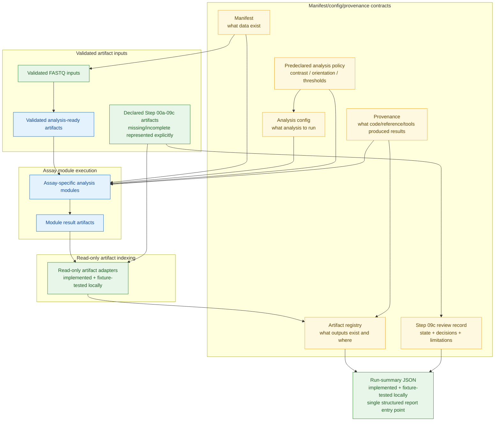

# Future Planned Architecture

This page describes the activated local roadmap beyond the current compute
pipeline. Step `09c` now exists and is fixture-tested locally. The
`artifact-schema-v1` foundation is also implemented and locally fixture-tested;
`artifact-adapters-v1` and `artifact-run-summary` are implemented and locally
fixture-tested. Report generation, foundation, validator, and modular tooling
remain planned until each named branch is implemented. The current pipeline is documented in
`docs/architecture/ARCHITECTURE.md`: the cluster-proven boundary remains Step
`06`, and Steps `07`-`09` remain not cluster-proven.

The local runtime boundary has moved. Signed and notarized Apple-silicon CRAN
R `4.6.1` is installed, and the repository has a guarded `renv` environment
locked to Bioconductor `3.23`. Namespace, lock, headless-PDF, and empty
cache-disabled binary restore checks pass. The Step `08` and Step `09` real-R
suites now pass locally without `SKIP`. The `step-09b1-real-r-fixes`
implementation at `eae5eca` adds raw DP/AD/INFO AD lexical preflight for Step
`08` and locale-independent raw-byte PDF fixture validation for Step `09`.
Step `09c` is implemented at `b674a31` and fixture-tested locally; it has no
production review evidence. `artifact-schema-v1` is implemented and locally
fixture-tested at `5f4d3b4`; `artifact-adapters-v1` is implemented and locally
fixture-tested at `4dbd32d`, with 50 focused adapter tests passing.
`artifact-run-summary` is implemented and locally fixture-tested at
`209bb19`, with 39 focused and 213 total Python tests passing.
`report-html-v1` is next. No production artifact index, run summary, or report
exists.

## Current vs future boundary

| Area | Current state | Future direction |
| ---- | ------------- | ---------------- |
| Core preprocessing | Steps `00a`-`06` cluster-proven across six samples | Generalized manifest-driven preprocessing backbone |
| Downstream analysis | Step `07` implemented and mocked-bcftools tested locally; Steps `08` and `09` implemented at `90335d8` and `e4371de`, hardened at `eae5eca`, and guarded real-R tested; Step `09c` implemented at `b674a31` and synthetic-fixture-tested; none has production scientific or Step `07`-`09` cluster evidence | Later assay-specific modules after explicit evidence/report foundations |
| Reporting | Handwritten demo/QC docs and generated step artifacts; Draft 2020-12 schemas and explicit 67-row inventory implemented at `5f4d3b4`; dry-run-first explicit adapter indexer implemented at `4dbd32d`; canonical JSON plus deterministic TSV/QC run-summary builder implemented at `209bb19`; no production artifact index or summary | Self-contained HTML and bundled-Typst PDF/TSV reports; not yet implemented |
| Data sources | Lab FASTQs on ADAM | Lab FASTQs first; possible public-dataset import later |

## Ordered roadmap boundary

Standalone source: `docs/architecture/diagrams/future_roadmap_sequence.mmd`.

```mermaid
flowchart TB
    classDef current fill:#e8f5e9,stroke:#2e7d32,color:#1b5e20
    classDef docs fill:#f5f5f5,stroke:#616161,color:#424242
    classDef runtime fill:#e3f2fd,stroke:#1565c0,color:#0d47a1
    classDef future fill:#f3e5f5,stroke:#6a1b9a,color:#4a148c
    classDef deferred fill:#fafafa,stroke:#757575,color:#424242,stroke-dasharray:4 3

    s09["step-09-cmh<br/>local implementation/docpatch complete"]
    s09a["step-09a-roadmap-docpatch<br/>documentation-only"]
    rlocal["step-09b-local-r-runtime<br/>R 4.6.1 + guarded renv / Bioc 3.23"]
    rfix["step-09b1-real-r-fixes<br/>complete locally; both suites pass"]
    science09c["step-09c-scientific-validation<br/>implemented + synthetic-fixture-tested locally<br/>production evidence unavailable"]
    artifact_schema["artifact-schema-v1<br/>implemented + locally fixture-tested<br/>no production artifact index"]
    artifact_adapters["artifact-adapters-v1<br/>implemented + locally fixture-tested<br/>no production index"]
    runsummary["artifact-run-summary<br/>implemented + locally fixture-tested<br/>no production summary"]
    reports["report-html-v1 next<br/>-> report-exports-v1"]
    foundations["post09-runtime-preflight<br/>-> post09-reference-provenance<br/>-> post09-storage-inventory-retention"]
    validators["one validation-report branch per step<br/>00a -> 00b -> 00c -> 01 -> 02 -> 02b<br/>-> 03 -> 04 -> 05 -> 06 -> 07 -> 08 -> 09"]
    remote["remote validation resumes later<br/>07 -> 08 -> 09 -> 09c -> targeted reruns"]

    s09 --> s09a --> rlocal --> rfix --> science09c
    science09c --> artifact_schema --> artifact_adapters --> runsummary --> reports --> foundations --> validators
    validators -.-> remote

    class s09,rfix,science09c,artifact_schema,artifact_adapters,runsummary current
    class s09a docs
    class rlocal runtime
    class reports,foundations,validators future
    class remote deferred
```



Every branch is a clean, docpatched descendant. The complete local lineage is:

```text
step-09b-local-r-runtime
-> step-09b1-real-r-fixes
-> step-09c-scientific-validation
-> artifact-schema-v1
-> artifact-adapters-v1
-> artifact-run-summary
-> report-html-v1
-> report-exports-v1
-> post09-runtime-preflight
-> post09-reference-provenance
-> post09-storage-inventory-retention
-> post09-validation-report-00a
-> post09-validation-report-00b
-> post09-validation-report-00c
-> post09-validation-report-01
-> post09-validation-report-02
-> post09-validation-report-02b
-> post09-validation-report-03
-> post09-validation-report-04
-> post09-validation-report-05
-> post09-validation-report-06
-> post09-validation-report-07
-> post09-validation-report-08
-> post09-validation-report-09
```

The `step-09b1-real-r-fixes` package was inserted after real-R execution found
one raw-count engine defect and one PDF fixture defect. The initial generic
Step `08` negative-fixture message had misattributed the later malformed-count
failure to its already-working partition-overlap validator. Step `09c` is
implemented at `b674a31`; it validates and summarizes declared evidence but
does not rerun CMH or infer review decisions. Its local fixtures are not
production review evidence. `artifact-schema-v1` is implemented and locally
fixture-tested at `5f4d3b4`; its four public Draft 2020-12 contracts share
versioned definitions and its explicit inventory declares 67 expected
artifacts without glob discovery. It has not generated a production artifact
index. `artifact-adapters-v1` is implemented at `4dbd32d`; its 49 read-only
adapters require the explicit run contract plus inventory, and its 50 focused
tests pass on synthetic native-output fixtures. `artifact-run-summary` is
implemented at `209bb19`; its 39 focused tests pass on synthetic adapter and
Step `09c` fixtures. HTML/PDF reports remain immediate, activated work before
the foundation/validator packages.
Remote validation is paused until the final local validator branch.

## Future modular dataflow

Standalone source: `docs/architecture/diagrams/future_modular_pipeline.mmd`.

```mermaid
flowchart LR
    classDef current fill:#e8f5e9,stroke:#2e7d32,color:#1b5e20
    classDef future fill:#e3f2fd,stroke:#1565c0,color:#0d47a1
    classDef deferred fill:#f5f5f5,stroke:#757575,color:#424242,stroke-dasharray:4 3
    classDef contract fill:#fff8e1,stroke:#f9a825,color:#5f4300
    classDef reporting fill:#f3e5f5,stroke:#6a1b9a,color:#4a148c

    subgraph sources["Data sources"]
        direction TB
        lab["Lab-generated FASTQs on ADAM"]
        public["Public genomics datasets<br/>deferred import"]
    end

    subgraph contracts["Configuration/contracts"]
        direction TB
        manifest["Sample manifest"]
        config["Analysis config"]
        policy_record["Versioned scientific policy<br/>review status + limitations"]
    end

    subgraph core["Core preprocessing"]
        direction TB
        backbone["Core preprocessing backbone"]
        ready["Validated analysis-ready artifacts"]
        registry["Artifact registry"]
    end

    subgraph modules["Analysis modules"]
        direction TB
        assays["Assay-specific analysis modules"]
        results["Standardized result artifacts"]
    end

    subgraph science["Scientific evidence and decision records"]
        direction TB
        declared09["Explicit Step 07-09 evidence<br/>missing/incomplete allowed"]
        science_review["Step 09c validation package<br/>implemented + fixture-tested locally"]
        decision_record["Review status + limitations<br/>ready state remains locked"]
    end

    subgraph reports["Reporting"]
        direction TB
        run_summary["Canonical run-summary JSON<br/>implemented + fixture-tested locally"]
        report_layer["HTML/PDF reporting layer<br/>pending"]
        outputs["QC reports / PI reports / candidate result reports / handoff reports"]
    end

    lab --> manifest
    public -.-> manifest
    manifest --> backbone
    config --> backbone
    manifest --> assays
    config --> assays
    policy_record --> config
    policy_record --> assays
    backbone --> ready --> assays --> results --> registry --> run_summary --> report_layer --> outputs
    declared09 --> science_review --> decision_record --> policy_record
    declared09 --> registry
    decision_record --> run_summary

    class lab,run_summary current
    class public deferred
    class manifest,config,policy_record,decision_record,science_review contract
    class backbone,ready future
    class registry contract
    class assays,results,declared09 future
    class report_layer,outputs reporting
```



## Manifest/config contracts

Standalone source: `docs/architecture/diagrams/future_manifest_config_contracts.mmd`.



## Reporting layer

Standalone source: `docs/architecture/diagrams/future_reporting_layer.mmd`.

The implemented summary boundary is:

```text
build_run_summary.py
  exact complete artifact receipt
  + optional exact Step 09c review summary
  -> canonical run_summary.json
  -> deterministic run_summary.tsv
  -> deterministic qc_summary.tsv
  -> run_summary_receipt.tsv published last
```

Only canonical JSON crosses into the future renderer. The TSV views are
outputs, not independent renderer inputs. No production summary exists.

```mermaid
flowchart TD
    classDef current fill:#e8f5e9,stroke:#2e7d32,color:#1b5e20
    classDef future fill:#e3f2fd,stroke:#1565c0,color:#0d47a1
    classDef contract fill:#fff8e1,stroke:#f9a825,color:#5f4300
    classDef reporting fill:#f3e5f5,stroke:#6a1b9a,color:#4a148c

    subgraph inputs["Schema-validated records"]
        direction TB
        schema["Versioned artifact schemas<br/>implemented + locally fixture-tested"]
        run_contract["Explicit six-field run contract"]
        inventory["Explicit expected-artifact inventory"]
        declared_sources["Explicit declared native sources<br/>missing/incomplete allowed"]
        science_summary["Optional exact Step 09c review summary<br/>never discovered"]
    end

    adapter_builder["artifact-adapters-v1 builder<br/>implemented + fixture-tested locally"]
    artifacts_tsv["artifact records + artifacts.tsv + receipt<br/>fixture-tested transaction<br/>production index absent"]
    aggregate["artifact-run-summary builder<br/>implemented + fixture-tested locally"]
    run_summary["run_summary.json<br/>canonical report entry point"]
    run_summary_tsv["run_summary.tsv<br/>deterministic artifact view"]
    qc_summary["qc_summary.tsv<br/>deterministic metric view"]
    summary_receipt["run_summary_receipt.tsv<br/>published last"]
    generator["Static QMD / Quarto renderer<br/>no analysis execution"]
    html["Self-contained HTML report"]
    exports["Bundled Typst PDF + TSV bundle"]

    subgraph review["Scientific review fields"]
        direction TB
        review_status["evidence_incomplete or<br/>science_review_complete_exploratory"]
        orientation_status["orientation policy status/version"]
        annotation_status["annotation provenance status"]
        adjudication_status["candidate adjudication status"]
        orthogonal_status["orthogonal validation status"]
        limitations["limitations"]
        review_record["Normalized Step 09c review record"]
    end

    subgraph outputs["Generated reports (pending)"]
        direction TB
        qc_report["QC and funnel summary"]
        validation_report["Steps 00a-09 evidence matrix"]
        candidate_report["CMH-ranked candidate section"]
        pi_report["Status-labeled PI report"]
        handoff_report["Methods / evidence appendix"]
        pdf_output["State-bannered PDF"]
        tsv_output["Report-bundle run-summary TSV"]
    end

    schema --> adapter_builder
    run_contract --> adapter_builder
    inventory --> adapter_builder
    declared_sources --> adapter_builder
    adapter_builder --> artifacts_tsv
    artifacts_tsv --> aggregate
    science_summary --> review_record --> aggregate
    aggregate --> run_summary
    aggregate --> run_summary_tsv
    aggregate --> qc_summary
    aggregate --> summary_receipt
    run_summary --> generator
    generator --> html
    html --> qc_report
    html --> validation_report
    html --> handoff_report
    html --> candidate_report
    html --> pi_report
    html --> exports
    exports --> pdf_output
    exports --> tsv_output
    review_status --> review_record
    orientation_status --> review_record
    annotation_status --> review_record
    adjudication_status --> review_record
    orthogonal_status --> review_record
    limitations --> review_record
    readylock["biological_interpretation_ready<br/>reserved and rejected by Step 09c"]
    readylock -.-> review_status

    class schema,adapter_builder,aggregate,run_summary,run_summary_tsv,qc_summary,summary_receipt current
    class run_contract,inventory,declared_sources,artifacts_tsv contract
    class science_summary,review_status,orientation_status,annotation_status,adjudication_status,orthogonal_status,limitations,review_record,readylock contract
    class generator,html,exports future
    class qc_report,validation_report,candidate_report,pi_report,handoff_report,pdf_output,tsv_output reporting
```



## Design principles

* Core preprocessing should produce validated reusable artifacts.
* Assay modules should contain assay-specific scientific logic.
* Reporting should consume standardized artifact indexes rather than guessing file paths.
* Artifact schemas and read-only adapters should precede native emitter
  retrofits.
* Missing, failed, incomplete, and externally unavailable evidence should be
  represented explicitly, never omitted by glob discovery.
* Operational/QC reports may describe computational evidence. Candidate
  reports may consume an exploratory review record only when they render that
  state and limitations explicitly. Step `09c` rejects the reserved
  `biological_interpretation_ready` state until a separate approved policy
  branch unlocks its exit criteria.
* Report generation never establishes computational validation, scientific
  review completion, or biological truth.
* Public datasets should enter through the same manifest/config/provenance model as lab-generated data.
* Invalid states should be refused loudly, especially missing contrasts, missing replicate structure, missing orientation policy, or inconsistent strandedness assumptions.
* Strand/orientation interpretation should stay explicit and PI-approved.

The current Step `08` reproduction uses `orientation_policy=legacy_provisional_v1`: `FWD_like` selects compatible `+` transcripts and complements genomic REF/ALT into RNA-normalized alleles, while `REV_like` selects compatible `-` transcripts and retains genomic REF/ALT. This is an implemented legacy-preservation contract, not a biologically validated policy or a future generalized module interface.

Activated local packages (Step `09b1` is complete; Step `09c` and
`artifact-schema-v1`, `artifact-adapters-v1`, and `artifact-run-summary` are
implemented and synthetic/contract-fixture-tested locally; `report-html-v1`
and every later package remain unimplemented until their own branches;
dependency order fixed):

```text
step-09b1-real-r-fixes
-> step-09c-scientific-validation
-> artifact-schema-v1
-> artifact-adapters-v1
-> artifact-run-summary
-> report-html-v1
-> report-exports-v1
-> post09-runtime-preflight
-> post09-reference-provenance
-> post09-storage-inventory-retention
-> post09-validation-report-00a
-> post09-validation-report-00b
-> post09-validation-report-00c
-> post09-validation-report-01
-> post09-validation-report-02
-> post09-validation-report-02b
-> post09-validation-report-03
-> post09-validation-report-04
-> post09-validation-report-05
-> post09-validation-report-06
-> post09-validation-report-07
-> post09-validation-report-08
-> post09-validation-report-09
```

The preflight, reference inventory, and storage inventory are read-only; no
automatic installation, repair, or cleanup is implied. Each step validator
uses explicit inputs and its own branch; no generic dispatcher or job array is
part of this sequence. Analysis config, module extraction, generalized
orchestration, public-data ingestion, and broad refactors remain deferred.

When remote work resumes after `post09-validation-report-09`, promotion remains
upstream-sequential through `validate-step-07`, `validate-step-08`,
`validate-step-09`, and `validate-step-09c-scientific-evidence`, followed only
by targeted reruns. Every remote evidence branch regenerates the structured
run summary and reports after evidence inspection.

## Implementation-boundary note

The local R environment, `step-09b1-real-r-fixes`, Step `09c`, and
`artifact-schema-v1`, `artifact-adapters-v1`, and `artifact-run-summary` are implemented at this
boundary. Environment/restore checks, both Step `08` and Step `09` semantic
real-R suites, the Step `09c` Python/shell fixtures, the artifact
schema/inventory fixtures, 50 focused adapter tests, and 39 focused
run-summary tests pass locally. There is
no production Step `07`-`09` or Step `09c` review evidence, no production
artifact index, run summary, or report, and no downstream cluster proof.
`report-html-v1` is next, and the remaining activated packages above are
plans, not runnable commands. Reports are immediate work, but no generated
report may be presented as production evidence or biological interpretation.
Do not preempt the branch sequence with remote validation, generic dispatchers,
arrays, broad helper extraction, automatic R-package installation in compute
wrappers, cleanup/lock deletion, report globbing/recomputation, moved compute
CLIs, or public-data import.
