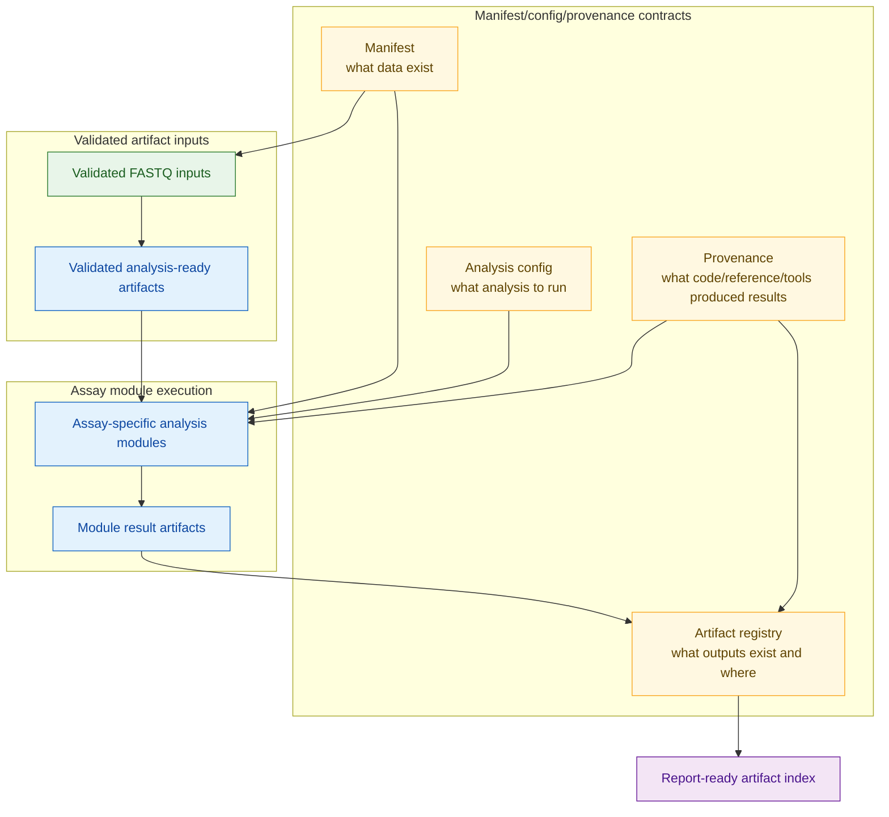
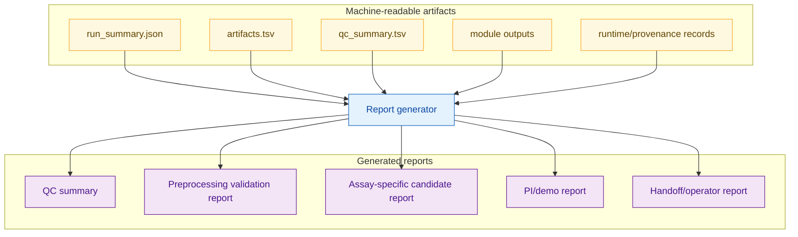

# Future Planned Architecture

This page describes a deferred target architecture. It is not the current implementation contract. The current validated pipeline is documented in `docs/architecture/ARCHITECTURE.md`; the immediate next implementation boundary remains Step `07`.

## Current vs future boundary

| Area | Current state | Future direction |
| ---- | ------------- | ---------------- |
| Core preprocessing | Steps `00a`-`06` cluster-proven across six samples | Generalized manifest-driven preprocessing backbone |
| Downstream analysis | Steps `07`-`09` pending legacy reproduction | Assay-specific modules consuming validated artifacts |
| Reporting | Demo/QC docs and generated step artifacts | Configurable report generation from artifact indexes |
| Data sources | Lab FASTQs on ADAM | Lab FASTQs first; possible public-dataset import later |

## Future modular dataflow

Standalone source: `docs/architecture/diagrams/future_modular_pipeline.mmd`.

```mermaid
flowchart LR
    classDef current fill:#e8f5e9,stroke:#2e7d32,color:#1b5e20
    classDef future fill:#e3f2fd,stroke:#1565c0,color:#0d47a1
    classDef deferred fill:#f5f5f5,stroke:#757575,color:#424242,stroke-dasharray:4 3
    classDef contract fill:#fff8e1,stroke:#f9a825,color:#5f4300
    classDef reporting fill:#f3e5f5,stroke:#6a1b9a,color:#4a148c

    subgraph sources["Data sources"]
        direction TB
        lab["Lab-generated FASTQs on ADAM"]
        public["Public genomics datasets<br/>deferred import"]
    end

    subgraph contracts["Configuration/contracts"]
        direction TB
        manifest["Sample manifest"]
        config["Analysis config"]
    end

    subgraph core["Core preprocessing"]
        direction TB
        backbone["Core preprocessing backbone"]
        ready["Validated analysis-ready artifacts"]
        registry["Artifact registry"]
    end

    subgraph modules["Analysis modules"]
        direction TB
        assays["Assay-specific analysis modules"]
        results["Standardized result artifacts"]
    end

    subgraph reports["Reporting"]
        direction TB
        report_layer["Reporting layer"]
        outputs["QC reports / PI reports / candidate result reports / handoff reports"]
    end

    lab --> manifest
    public -.-> manifest
    manifest --> backbone
    config --> backbone
    backbone --> ready --> registry --> assays --> results --> report_layer --> outputs

    class lab current
    class public deferred
    class manifest,config contract
    class backbone,ready future
    class registry contract
    class assays,results future
    class report_layer,outputs reporting
```

## Manifest/config contracts

Standalone source: `docs/architecture/diagrams/future_manifest_config_contracts.mmd`.

## Reporting layer

Standalone source: `docs/architecture/diagrams/future_reporting_layer.mmd`.

## Design principles

* Core preprocessing should produce validated reusable artifacts.
* Assay modules should contain assay-specific scientific logic.
* Reporting should consume standardized artifact indexes rather than guessing file paths.
* Public datasets should enter through the same manifest/config/provenance model as lab-generated data.
* Invalid states should be refused loudly, especially missing contrasts, missing replicate structure, missing orientation policy, or inconsistent strandedness assumptions.
* Strand/orientation interpretation should stay explicit and PI-approved.

## Deferred implementation note

This architecture is deferred. First priority remains reproducing the legacy Steps 07-09 workflow using the validated Step 06 outputs. Modularization, artifact indexes, public-dataset import, and report generation should be evaluated after the legacy analysis path is working and reviewed.
