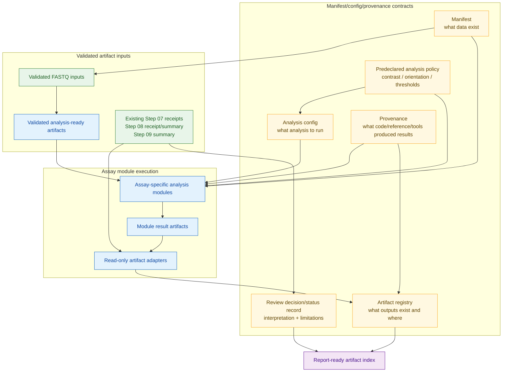
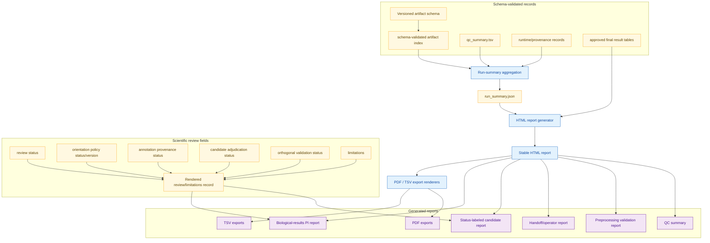

# Future Planned Architecture

This page describes a deferred target architecture. It is not the current
implementation contract. The current pipeline is documented in
`docs/architecture/ARCHITECTURE.md`: the cluster-proven boundary remains Step
`06`; Steps `07`-`09` are implemented and tested at their available local
boundaries but are not cluster-proven; and the Step `08` and Step `09` real-R
fixture suites are runtime-blocked because this workstation has no `Rscript`.
The Step `09` implementation/docpatch gate is complete and pushed at
`9ac8307`; the current `step-09a-roadmap-docpatch` is documentation-only and
has no runtime or biological evidence.

## Current vs future boundary

| Area | Current state | Future direction |
| ---- | ------------- | ---------------- |
| Core preprocessing | Steps `00a`-`06` cluster-proven across six samples | Generalized manifest-driven preprocessing backbone |
| Downstream analysis | Step `07` implemented and mocked-bcftools tested locally; Steps `08` and `09` implemented at `90335d8` and `e4371de` and shell/fake-R tested locally, with real-R runtime validation blocked; none has cluster evidence | Assay-specific modules consuming validated artifacts |
| Reporting | Demo/QC docs and generated step artifacts | Configurable report generation from artifact indexes |
| Data sources | Lab FASTQs on ADAM | Lab FASTQs first; possible public-dataset import later |

## Ordered roadmap boundary

Standalone source: `docs/architecture/diagrams/future_roadmap_sequence.mmd`.

```mermaid
flowchart LR
    classDef current fill:#e8f5e9,stroke:#2e7d32,color:#1b5e20
    classDef docs fill:#f5f5f5,stroke:#616161,color:#424242
    classDef validation fill:#e3f2fd,stroke:#1565c0,color:#0d47a1
    classDef science fill:#fff8e1,stroke:#f9a825,color:#5f4300
    classDef future fill:#f3e5f5,stroke:#6a1b9a,color:#4a148c
    classDef deferred fill:#fafafa,stroke:#757575,color:#424242,stroke-dasharray:4 3

    s09["step-09-cmh<br/>local implementation/docpatch complete"]
    s09a["step-09a-roadmap-docpatch<br/>documentation-only"]
    v07["validate-step-07<br/>25 receipts / 50 primary VCFs"]
    v08["validate-step-08<br/>50 receipt rows / 3 outputs"]
    v09["validate-step-09<br/>6 reconciled outputs"]
    science09b["step-09b-scientific-validation<br/>exploratory-complete or interpretation-ready"]
    operations["operational foundations<br/>preflight -> provenance -> storage/retention<br/>-> validators -> targeted reruns"]
    artifacts["structured artifacts<br/>schema -> adapters -> run summary"]
    reports["reporting<br/>HTML -> PDF/TSV exports"]
    configmodule["analysis config -> thin rna_editing_cmh module"]
    second["general core refactor<br/>only after a second real cohort"]
    public["public SRA/GEO/ENA ingestion<br/>last"]

    s09 --> s09a --> v07 --> v08 --> v09 --> science09b
    science09b --> operations --> artifacts --> reports --> configmodule --> second
    second -.-> public

    class s09 current
    class s09a docs
    class v07,v08,v09 validation
    class science09b science
    class operations,artifacts,reports,configmodule future
    class second,public deferred
```



Every branch is a clean descendant. The three validation branches require
inspected runtime evidence and an evidence docpatch before continuing.
`step-09b-scientific-validation` is a separate scientific-policy gate, not a
runnable Step `10`. Only after it exits may the ordered operational,
artifact/reporting, config/module, and generalization packages begin.

## Future modular dataflow

Standalone source: `docs/architecture/diagrams/future_modular_pipeline.mmd`.

```mermaid
flowchart LR
    classDef current fill:#e8f5e9,stroke:#2e7d32,color:#1b5e20
    classDef future fill:#e3f2fd,stroke:#1565c0,color:#0d47a1
    classDef deferred fill:#f5f5f5,stroke:#757575,color:#424242,stroke-dasharray:4 3
    classDef contract fill:#fff8e1,stroke:#f9a825,color:#5f4300
    classDef reporting fill:#f3e5f5,stroke:#6a1b9a,color:#4a148c

    subgraph sources["Data sources"]
        direction TB
        lab["Lab-generated FASTQs on ADAM"]
        public["Public genomics datasets<br/>deferred import"]
    end

    subgraph contracts["Configuration/contracts"]
        direction TB
        manifest["Sample manifest"]
        config["Analysis config"]
        policy_record["Versioned scientific policy<br/>review status + limitations"]
    end

    subgraph core["Core preprocessing"]
        direction TB
        backbone["Core preprocessing backbone"]
        ready["Validated analysis-ready artifacts"]
        registry["Artifact registry"]
    end

    subgraph modules["Analysis modules"]
        direction TB
        assays["Assay-specific analysis modules"]
        results["Standardized result artifacts"]
    end

    subgraph science["Scientific gate before module generalization"]
        direction TB
        proven09["Runtime-proven Step 09 outputs"]
        science_review["Step 09b scientific review"]
        decision_record["Review decision record"]
    end

    subgraph reports["Reporting"]
        direction TB
        report_layer["Reporting layer"]
        outputs["QC reports / PI reports / candidate result reports / handoff reports"]
    end

    lab --> manifest
    public -.-> manifest
    manifest --> backbone
    config --> backbone
    manifest --> assays
    config --> assays
    policy_record --> config
    policy_record --> assays
    backbone --> ready --> assays --> results --> registry --> report_layer --> outputs
    proven09 --> science_review --> decision_record --> policy_record
    proven09 --> registry
    decision_record --> report_layer

    class lab current
    class public deferred
    class manifest,config,policy_record,decision_record contract
    class backbone,ready future
    class registry contract
    class assays,results,proven09,science_review future
    class report_layer,outputs reporting
```



## Manifest/config contracts

Standalone source: `docs/architecture/diagrams/future_manifest_config_contracts.mmd`.



## Reporting layer

Standalone source: `docs/architecture/diagrams/future_reporting_layer.mmd`.



## Design principles

* Core preprocessing should produce validated reusable artifacts.
* Assay modules should contain assay-specific scientific logic.
* Reporting should consume standardized artifact indexes rather than guessing file paths.
* Artifact schemas and read-only adapters should precede native emitter
  retrofits.
* Operational/QC reports may describe computational evidence. Candidate
  reports may consume an exploratory review record only when they render that
  state and limitations explicitly; biological claims require
  `biological_interpretation_ready`.
* Public datasets should enter through the same manifest/config/provenance model as lab-generated data.
* Invalid states should be refused loudly, especially missing contrasts, missing replicate structure, missing orientation policy, or inconsistent strandedness assumptions.
* Strand/orientation interpretation should stay explicit and PI-approved.

The current Step `08` reproduction uses `orientation_policy=legacy_provisional_v1`: `FWD_like` selects compatible `+` transcripts and complements genomic REF/ALT into RNA-normalized alleles, while `REV_like` selects compatible `-` transcripts and retains genomic REF/ALT. This is an implemented legacy-preservation contract, not a biologically validated policy or a future generalized module interface.

Ordered post-proof packages (candidate labels until each package is separately
activated; dependency order fixed):

```text
post09-runtime-preflight
-> post09-reference-provenance
-> post09-storage-inventory-retention
-> post09-validation-reports
-> post09-targeted-reruns
-> artifact-schema-v1
-> artifact-adapters-v1
-> artifact-run-summary
-> report-html-v1
-> report-exports-v1
-> analysis-config-v1
-> rna-editing-cmh-module
-> reusable-core refactor after a second real cohort
-> public SRA/GEO/ENA ingestion
```

The preflight and storage inventory are read-only; no automatic installation
or cleanup is implied. Step-specific validators come before a generic
dispatcher. Job arrays require demonstrated repeated need. The module is a
thin wrapper that preserves proven Step `07`-`09` CLIs and paths. General
refactoring needs a second cohort, and public ingestion comes last through the
same manifest/config/provenance contracts.

Promotion-specific environment, reference, and storage evidence is collected
manually now. The first three later packages productize those checks into
reusable tooling for future runs/cohorts; their later position does not defer
the current runbook prerequisites.

## Deferred implementation note

This architecture is deferred. Steps `07`-`09` are now implemented locally;
the documentation-only `step-09a-roadmap-docpatch` is the clean/pushed roadmap
boundary. Cluster promotion begins with Step `07` and proceeds sequentially
through Steps `08` and `09`, with
evidence docpatches between stages, followed by
`step-09b-scientific-validation`. The ordered packages above remain
non-runnable until activated. Do not preempt them with generic dispatchers,
arrays, broad helper-library extraction, automatic R installation, unproven
tool-path config, cleanup/lock deletion, report globbing/recomputation, moving
proven scripts, or public-data import.
