# Semantic workflow identity and DAG

This file is the canonical cross-stage owner for semantic workflow identities,
historical aliases, direct artifact dependencies, edge semantics, typed
external inputs, and the concise DAG. Individual stage, analysis, and evidence
contracts own their local interfaces and link here instead of copying the
complete map.

The map describes the currently supported default workflow. It does not claim
that every future assay has one universal sequence, and it does not define
preprocessing profiles, optional-stage policy, ingestion, orchestration, or
archival behavior.

## Identity rules

- Every functional owner has exactly one kind: `stage`, `analysis`, or
  `evidence`.
- The public slug is the established semantic working name, unchanged.
- The display title humanizes that slug while preserving scientific acronyms.
- The machine key is generated once as `emrys.<kind>.<slug>.v1` and then
  frozen. Historical or execution order is never encoded in the key.
- A title, path, implementation, or DAG-position change does not by itself
  change or bump the frozen machine key.
- Numeric identifiers are historical aliases and provenance only. They do not
  define identity or order.

## Identity map

| Kind | Display title | Public slug | Frozen machine key | Historical aliases |
| --- | --- | --- | --- | --- |
| stage | Construct STAR Index | `construct_STAR_index` | `emrys.stage.construct_STAR_index.v1` | `00a` |
| stage | Convert GTF to BED12 | `convert_GTF_to_BED12` | `emrys.stage.convert_GTF_to_BED12.v1` | `00b` |
| stage | Construct FASTA Sidecars | `construct_FASTA_sidecars` | `emrys.stage.construct_FASTA_sidecars.v1` | `00c` |
| stage | Align RNA Reads with STAR | `align_RNA_reads_with_STAR` | `emrys.stage.align_RNA_reads_with_STAR.v1` | `01` |
| stage | Construct Canonical BAM | `construct_canonical_BAM` | `emrys.stage.construct_canonical_BAM.v1` | `02` |
| evidence | Collect Canonical BAM QC Evidence | `collect_canonical_BAM_QC_evidence` | `emrys.evidence.collect_canonical_BAM_QC_evidence.v1` | `02b` |
| evidence | Collect RSeQC Paired Orientation Evidence | `collect_RSeQC_paired_orientation_evidence` | `emrys.evidence.collect_RSeQC_paired_orientation_evidence.v1` | `03` |
| stage | Mark BAM Duplicates with Picard | `mark_BAM_duplicates_with_Picard` | `emrys.stage.mark_BAM_duplicates_with_Picard.v1` | `04` |
| stage | Split N-Cigar Reads with GATK | `split_N_cigar_reads_with_GATK` | `emrys.stage.split_N_cigar_reads_with_GATK.v1` | `05` |
| stage | Partition BAM by Mechanical Read Orientation | `partition_BAM_by_mechanical_read_orientation` | `emrys.stage.partition_BAM_by_mechanical_read_orientation.v1` | `06` |
| stage | Generate Partitioned Cohort Mpileup VCFs | `generate_partitioned_cohort_mpileup_VCFs` | `emrys.stage.generate_partitioned_cohort_mpileup_VCFs.v1` | `07` |
| stage | Preprocess and Annotate Cohort Candidates | `preprocess_and_annotate_cohort_candidates` | `emrys.stage.preprocess_and_annotate_cohort_candidates.v1` | `08` |
| analysis | Rank Cohort Candidates with Paired CMH | `rank_cohort_candidates_with_paired_CMH` | `emrys.analysis.rank_cohort_candidates_with_paired_CMH.v1` | `09` |
| analysis | Project Candidate Scientific Context | `project_candidate_scientific_context` | `emrys.analysis.project_candidate_scientific_context.v1` | `10` |

## Edge semantics

A direct DAG edge exists only when one functional owner produces an artifact
required by another functional owner. Validators remain within their
functional owner and are not DAG nodes.

- `required artifact` records direct producer-to-consumer necessity.
- `fan-in` requires the named artifacts from distinct upstream owners.
- `barrier` requires the complete declared set named by the consumer contract,
  not merely one available artifact.
- `evidence branch` distinguishes non-gating evidence flow from a gating
  transformation.
- A typed external input enters one or more owners without creating a producer
  stage in this DAG.
- Current operational coupling is recorded separately and never promoted to a
  permanent semantic dependency merely because one execution path
  materializes a shared input.

Parallelism follows from the absence of a required edge; numeric aliases,
filename order, narrative order, shared directories, and validator imports do
not create edges.

## Typed external inputs

| Input type | Meaning | Current semantic consumers |
| --- | --- | --- |
| `reference_fasta` | Materialized reference FASTA supplied outside the computational-stage DAG. | `construct_STAR_index`, `construct_FASTA_sidecars`, `split_N_cigar_reads_with_GATK`, `generate_partitioned_cohort_mpileup_VCFs`, `project_candidate_scientific_context` |
| `reference_gtf` | Materialized reference GTF supplied outside the computational-stage DAG. | `construct_STAR_index`, `convert_GTF_to_BED12`, `preprocess_and_annotate_cohort_candidates` |
| `paired_rna_fastq` | One externally supplied read-1/read-2 RNA-seq FASTQ pair for a declared sample. | `align_RNA_reads_with_STAR` |
| `sample_manifest` | Explicit sample identities and canonical sample order. | `generate_partitioned_cohort_mpileup_VCFs`, `preprocess_and_annotate_cohort_candidates`, `rank_cohort_candidates_with_paired_CMH` |
| `partition_manifest` | Explicit partition identities and selectors. | `generate_partitioned_cohort_mpileup_VCFs`, `preprocess_and_annotate_cohort_candidates`, `rank_cohort_candidates_with_paired_CMH` |

Runtime tools and scalar parameters are stage-local contract inputs, not DAG
nodes.

## Direct DAG edges

This table is the complete set of direct artifact edges for the currently
supported default workflow.

| Producer | Consumer | Artifact | Semantics |
| --- | --- | --- | --- |
| `construct_STAR_index` | `align_RNA_reads_with_STAR` | STAR genome-index directory | required artifact |
| `align_RNA_reads_with_STAR` | `construct_canonical_BAM` | coordinate-sorted STAR BAM | required artifact |
| `construct_canonical_BAM` | `collect_canonical_BAM_QC_evidence` | canonical BAM/BAI pair | required artifact; non-gating evidence branch |
| `construct_canonical_BAM` | `collect_RSeQC_paired_orientation_evidence` | canonical BAM/BAI pair | required artifact; fan-in; non-gating evidence branch |
| `convert_GTF_to_BED12` | `collect_RSeQC_paired_orientation_evidence` | BED12 annotation | required artifact; fan-in; non-gating evidence branch |
| `construct_canonical_BAM` | `mark_BAM_duplicates_with_Picard` | canonical BAM/BAI pair | required artifact |
| `mark_BAM_duplicates_with_Picard` | `split_N_cigar_reads_with_GATK` | duplicate-marked BAM/BAI pair | required artifact; fan-in |
| `construct_FASTA_sidecars` | `split_N_cigar_reads_with_GATK` | reference FAI and sequence dictionary | required artifact; fan-in |
| `split_N_cigar_reads_with_GATK` | `partition_BAM_by_mechanical_read_orientation` | split-N-cigar BAM/BAI pair | required artifact |
| `partition_BAM_by_mechanical_read_orientation` | `generate_partitioned_cohort_mpileup_VCFs` | both orientation BAM/BAI pairs for every declared sample | required artifact; declared-sample barrier; fan-in |
| `construct_FASTA_sidecars` | `generate_partitioned_cohort_mpileup_VCFs` | reference FAI paired with the external reference FASTA | required artifact; fan-in |
| `generate_partitioned_cohort_mpileup_VCFs` | `preprocess_and_annotate_cohort_candidates` | receipt and both orientation VCFs for every declared partition | required artifact; declared-partition-and-orientation barrier |
| `preprocess_and_annotate_cohort_candidates` | `rank_cohort_candidates_with_paired_CMH` | sites table and Step 08 input receipt | required artifact |
| `rank_cohort_candidates_with_paired_CMH` | `project_candidate_scientific_context` | all-sites, significant-sites, and summary tables | required artifact; complete Step 09 transaction barrier |
| `construct_FASTA_sidecars` | `project_candidate_scientific_context` | reference FAI paired with the external reference FASTA | required artifact; fan-in |

## Current operational coupling that is not a semantic edge

The retired Step `00a` scheduler wrapper formerly decompressed and materialized
the shared FASTA and GTF used by historical Steps `00b` and `00c`. That
reference-materialization coupling never created `00a -> 00b` or `00a -> 00c`
DAG edges because neither downstream owner consumes the STAR index. The
current workflow admits the FASTA and GTF as typed external inputs rather than
as outputs of a new reference-preparation stage.

## Concise DAG

Node labels use public slugs; machine keys remain in the identity map.

```mermaid
flowchart LR
    construct_STAR_index["Construct STAR Index"]
    convert_GTF_to_BED12["Convert GTF to BED12"]
    construct_FASTA_sidecars["Construct FASTA Sidecars"]
    align_RNA_reads_with_STAR["Align RNA Reads with STAR"]
    construct_canonical_BAM["Construct Canonical BAM"]
    collect_canonical_BAM_QC_evidence["Collect Canonical BAM QC Evidence"]
    collect_RSeQC_paired_orientation_evidence["Collect RSeQC Paired Orientation Evidence"]
    mark_BAM_duplicates_with_Picard["Mark BAM Duplicates with Picard"]
    split_N_cigar_reads_with_GATK["Split N-Cigar Reads with GATK"]
    partition_BAM_by_mechanical_read_orientation["Partition BAM by Mechanical Read Orientation"]
    generate_partitioned_cohort_mpileup_VCFs["Generate Partitioned Cohort Mpileup VCFs"]
    preprocess_and_annotate_cohort_candidates["Preprocess and Annotate Cohort Candidates"]
    rank_cohort_candidates_with_paired_CMH["Rank Cohort Candidates with Paired CMH"]
    project_candidate_scientific_context["Project Candidate Scientific Context"]

    construct_STAR_index -->|STAR index| align_RNA_reads_with_STAR
    align_RNA_reads_with_STAR -->|STAR BAM| construct_canonical_BAM
    construct_canonical_BAM -.->|BAM/BAI; non-gating| collect_canonical_BAM_QC_evidence
    construct_canonical_BAM -.->|BAM/BAI; fan-in| collect_RSeQC_paired_orientation_evidence
    convert_GTF_to_BED12 -.->|BED12; fan-in| collect_RSeQC_paired_orientation_evidence
    construct_canonical_BAM -->|canonical BAM/BAI| mark_BAM_duplicates_with_Picard
    mark_BAM_duplicates_with_Picard -->|marked BAM/BAI; fan-in| split_N_cigar_reads_with_GATK
    construct_FASTA_sidecars -->|FAI/DICT; fan-in| split_N_cigar_reads_with_GATK
    split_N_cigar_reads_with_GATK -->|split BAM/BAI| partition_BAM_by_mechanical_read_orientation
    partition_BAM_by_mechanical_read_orientation -->|all samples; both BAM/BAI pairs| generate_partitioned_cohort_mpileup_VCFs
    construct_FASTA_sidecars -->|FAI; FASTA is external| generate_partitioned_cohort_mpileup_VCFs
    generate_partitioned_cohort_mpileup_VCFs -->|all partitions and orientations| preprocess_and_annotate_cohort_candidates
    preprocess_and_annotate_cohort_candidates -->|sites and input receipt| rank_cohort_candidates_with_paired_CMH
    rank_cohort_candidates_with_paired_CMH -->|complete candidate transaction| project_candidate_scientific_context
    construct_FASTA_sidecars -->|FAI; FASTA is external| project_candidate_scientific_context
```

