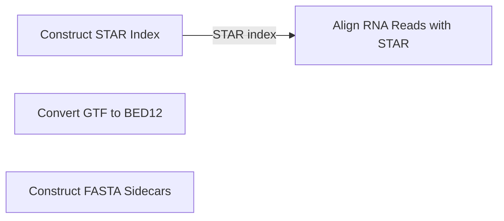

# Semantic workflow identity and DAG

This file is the canonical cross-stage owner for semantic workflow identities,
historical aliases, direct artifact dependencies, edge semantics, typed
external inputs, and the concise DAG. Individual stage, analysis, and evidence
contracts own their local interfaces and link here instead of copying the
complete map.

The map describes the currently supported default workflow. It does not claim
that every future assay has one universal sequence, and it does not define
preprocessing profiles, optional-stage policy, ingestion, orchestration, or
archival behavior.

## Identity rules

- Every functional owner has exactly one kind: `stage`, `analysis`, or
  `evidence`.
- The public slug is the established semantic working name, unchanged.
- The display title humanizes that slug while preserving scientific acronyms.
- The machine key is generated once as `norad.<kind>.<slug>.v1` and then
  frozen. Historical or execution order is never encoded in the key.
- A title, path, implementation, or DAG-position change does not by itself
  change or bump the frozen machine key.
- Numeric identifiers are historical aliases and provenance only. They do not
  define identity or order.

## Identity map

| Kind | Display title | Public slug | Frozen machine key | Historical aliases |
| --- | --- | --- | --- | --- |
| stage | Construct STAR Index | `construct_STAR_index` | `norad.stage.construct_STAR_index.v1` | `00a` |
| stage | Convert GTF to BED12 | `convert_GTF_to_BED12` | `norad.stage.convert_GTF_to_BED12.v1` | `00b` |
| stage | Construct FASTA Sidecars | `construct_FASTA_sidecars` | `norad.stage.construct_FASTA_sidecars.v1` | `00c` |
| stage | Align RNA Reads with STAR | `align_RNA_reads_with_STAR` | `norad.stage.align_RNA_reads_with_STAR.v1` | `01` |

## Edge semantics

A direct DAG edge exists only when one functional owner produces an artifact
required by another functional owner. Validators remain within their
functional owner and are not DAG nodes.

- `required artifact` records direct producer-to-consumer necessity.
- `fan-in` requires the named artifacts from distinct upstream owners.
- `barrier` requires the complete declared set named by the consumer contract,
  not merely one available artifact.
- `evidence branch` and `review lineage` distinguish non-computational evidence
  flow from a gating transformation.
- A typed external input enters one or more owners without creating a producer
  stage in this DAG.
- Current operational coupling is recorded separately and never promoted to a
  permanent semantic dependency merely because one wrapper materializes a
  shared input today.

Parallelism follows from the absence of a required edge; numeric aliases,
filename order, narrative order, shared directories, and validator imports do
not create edges.

## Typed external inputs

| Input type | Meaning | Current semantic consumers |
| --- | --- | --- |
| `reference_fasta` | Materialized reference FASTA supplied outside the computational-stage DAG. | `construct_STAR_index`, `construct_FASTA_sidecars` |
| `reference_gtf` | Materialized reference GTF supplied outside the computational-stage DAG. | `construct_STAR_index`, `convert_GTF_to_BED12` |
| `paired_rna_fastq` | One externally supplied read-1/read-2 RNA-seq FASTQ pair for a declared sample. | `align_RNA_reads_with_STAR` |

Runtime tools and scalar parameters are stage-local contract inputs, not DAG
nodes.

## Direct DAG edges

Edges are added only after both endpoint identities and the exact required
artifact have been frozen from their functional contracts.

| Producer | Consumer | Artifact | Semantics |
| --- | --- | --- | --- |
| `construct_STAR_index` | `align_RNA_reads_with_STAR` | STAR genome-index directory | required artifact |

## Current operational coupling that is not a semantic edge

Historical Step `00a` currently decompresses and materializes the shared FASTA
and GTF used by historical Steps `00b` and `00c`. That wrapper behavior is
reference-materialization coupling; neither downstream owner consumes the STAR
index, and the coupling does not create `00a -> 00b` or `00a -> 00c` DAG edges.
The materialized FASTA and GTF remain typed external inputs rather than a new
reference-preparation stage.

## Concise DAG

The graph is expanded as endpoint identities and direct artifact edges are
frozen. Node labels use public slugs; machine keys remain in the identity map.

